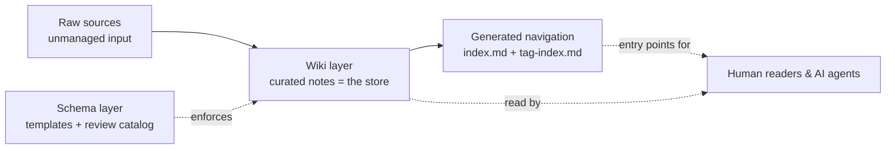

# Documentation Deployment Playbook

> An agent-first guide to building a project's base documentation. This repo is **pure
> methodology**: rules, diagrams, copyable templates and an executable bootstrap runbook. It
> dogfoods itself — the structure below follows every rule it preaches.

**The one-sentence thesis:** *the files are the store; the organization IS the index; validation
and navigation are designed, not discovered.*

## Start here (agents)

1. Read [guidelines/09-bootstrap-workflow.md](guidelines/09-bootstrap-workflow.md) — the runbook.
2. Read [guidelines/00-core-principles.md](guidelines/00-core-principles.md) — the nine principles.
3. Jump to a guideline only when the runbook's step points there. Never guess paths — the
   table below is the map.

## How to navigate this repo

| File | Purpose | When to read |
|---|---|---|
| [guidelines/00-core-principles.md](guidelines/00-core-principles.md) | The nine load-bearing principles, the anti-patterns they kill, and the source-of-truth precedence list. | First principles — reached at runbook Step 1. |
| [guidelines/01-structure.md](guidelines/01-structure.md) | Three-layer model, folder anatomy, hubs, one-topic-per-file. | Before creating any folder. |
| [guidelines/02-document-contract.md](guidelines/02-document-contract.md) | Frontmatter keys, body sections, naming, dual vocabulary. | Before writing any note. |
| [guidelines/03-lifecycle-and-generated-files.md](guidelines/03-lifecycle-and-generated-files.md) | Status lifecycle (draft/active/superseded/expired; archived out of root), generated-file markers. | When docs start rotting or tools write into human files. |
| [guidelines/04-validation.md](guidelines/04-validation.md) | The review catalog: what counts as an error, what as a warning. | When the corpus stops being trustworthy. |
| [guidelines/05-agent-navigation.md](guidelines/05-agent-navigation.md) | How an AI reads the corpus: query loop, citations, sandbox, staleness. | If any consumer of the docs is a model. |
| [guidelines/06-project-md.md](guidelines/06-project-md.md) | Starting `docs/project.md`: section anatomy, the Slices routing table, bootstrap order. | Before letting an agent touch a repo. |
| [guidelines/07-agent-consumption.md](guidelines/07-agent-consumption.md) | The docs↔machine interface: five load tiers, two pipeline stages, five wiring rules. | When a model or tool consumes the docs. |
| [guidelines/08-brownfield.md](guidelines/08-brownfield.md) | Documenting an already-started project: slices first, then the ratchet. | When the repo exists before its docs do. |
| [guidelines/09-bootstrap-workflow.md](guidelines/09-bootstrap-workflow.md) | The agent bootstrap runbook: ordered steps chaining 00–08 + the protocols. | Operational starting point — before touching any file. |
| [index.md](index.md) | Generated tree + stats (region `index`). Regenerate via `node validate.js --write`. | To see what the corpus holds; before a review. |
| [tag-index.md](tag-index.md) | Generated tag → docs surface (region `tags`). | When the vocabulary is unknown — search by tag. |
| [validate.js](validate.js) | Methodology-reference corpus validator: `node validate.js`, rooted at the script directory; only `--write` is accepted. | Before merging changes to this methodology repo. |
| [validate-consumer.js](validate-consumer.js) | Read-only consumer-layout subset checker: `node validate-consumer.js --root <project>`, exit 1 on errors. Not full 04 parity. | After generating or changing a consumer project's docs; use the script's actual available path. |
| [adrs/adr-index.md](adrs/adr-index.md) | Decision records (append-only), listed by the ADR hub. | When a rule's *why* is questioned. |
| [templates/document-template.md](templates/document-template.md) | Copyable contract for a new note. | On every new note. |
| [templates/adr-template.md](templates/adr-template.md) | Copyable shape for a decision record. | On every structural/schema decision. |
| [templates/hub-template.md](templates/hub-template.md) | Copyable shape for a folder hub (`<folder>-index.md`). | Before creating any folder. |
| [templates/project-md-template.md](templates/project-md-template.md) | Copyable nine-section `project.md` skeleton. | Before letting an agent touch a repo. |
| [templates/slice-generalities-template.md](templates/slice-generalities-template.md) | Copyable shape for a slice generalities doc. | On every brownfield slice (08 Step 1). |
| [templates/interface-surface-template.md](templates/interface-surface-template.md) | Copyable shape for an interface-surface sheet (catalog or contract mode). | When documenting a group's surfaces or payload contract. |
| [templates/ui-inventory-template.md](templates/ui-inventory-template.md) | Copyable shape for a UI/components/styles inventory sheet. | Before adding a surface readers must choose among. |
| [templates/troubleshooting-template.md](templates/troubleshooting-template.md) | Copyable shape for a troubleshooting sheet (quick-ref + deep-dive). | When a symptom string needs its root-cause write-up. |
| [protocols/new-note-protocol.md](protocols/new-note-protocol.md) | New-note protocol. | After writing. |
| [protocols/bootstrap-protocol.md](protocols/bootstrap-protocol.md) | Bootstrap protocol. | Before the merge. |
| [diagrams/documentation-architecture.html](diagrams/documentation-architecture.html) | Self-contained whiteboard overview of the whole system. | To get the picture in one look. |

## The system at a glance



Three operations run on the corpus, matching the three things that go wrong:

- **Intake** — new/changed notes get indexed and registered in their hub.
- **Query** — readers and agents enter through generated indexes, never by guessing paths.
- **Review** — a reader walks the catalog against changed notes; errors block the merge, warnings advise.

## Repo anatomy

```
your-project/
├── README.md              ← you are here (the single entry point)
├── index.md               ← generated tree + stats — `node validate.js --write`
├── tag-index.md           ← generated tag → docs surface
├── validate.js            ← methodology-reference corpus only; `node validate.js`
├── validate-consumer.js   ← consumer-layout subset; read-only, explicit --root
├── validate-consumer.test.js ← Node built-in tests; temporary consumer fixtures
├── adrs/                  ← decision records (append-only), one hub
├── guidelines/            ← the methodology (one topic per file, numbered reading order 00–09)
├── templates/             ← the schema layer applied to this repo itself
├── protocols/             ← the project's procedures: repeatable tasks you run by hand
└── diagrams/              ← derived visual artifacts, read-only, never a source of truth
```

For a consumer project, the prescribed generated layout is `docs/project.md` plus two folders:
`docs/context/` for strategic docs and `docs/protocols/` for procedures — see
[guidelines/06-project-md.md](guidelines/06-project-md.md).

This methodology repo intentionally has **no `docs/project.md` or project slice router**.
Its root `tag-index.md` is distinct from a consumer's canonical `docs/tag-index.md`.
`validate.js` uses this repo's classes and cannot validate a copied consumer layout, even
if invoked from that project's working directory; `--root` is rejected before any writes.

From this checkout, run `node validate-consumer.js --root <project>`. From elsewhere, run
`node "<methodology-checkout>/validate-consumer.js" --root <project>` using the real available
script path — bootstrap does not imply either validator was copied into the project.
The consumer checker never writes or regenerates indexes. `docs/project.md` is required;
`docs/context/`, `docs/protocols/` and `docs/tag-index.md` may be absent at bootstrap, but
links to absent targets still fail. For the subset and limitations, see
[guidelines/04-validation.md](guidelines/04-validation.md). Run its tests with
`node --test validate-consumer.test.js`.
