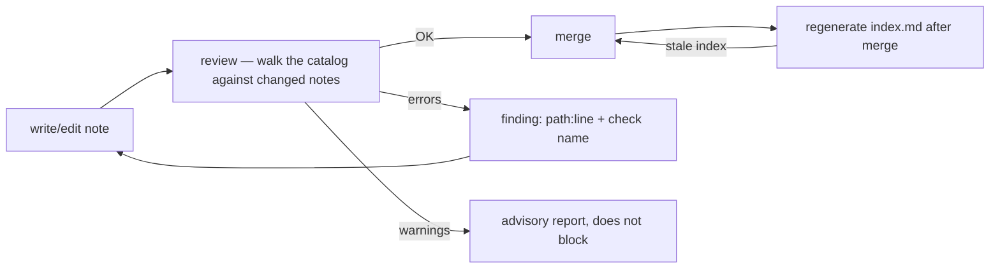

# Validation: The Corpus Is Reviewed, Not Trusted

## Problem

"Keep the docs updated" is not a mechanism. Without a review that answers *is this corpus
trustworthy right now?* against an explicit catalog of checks, every trust claim in the notes
decays at the speed of reality.

## Solution

One habit: before a change is merged, a reader walks an explicit catalog of checks split into two
severities: **errors block the merge**, **warnings advise** (never block). The catalog below is
the distilled starting set — nine errors, three warnings; adopt it wholesale and extend it only
with what actually bites you.

### Error catalog (blocks the merge)

| Check | What it catches | Catches which rot |
|---|---|---|
| **metadata outside the contract** | All required frontmatter keys present, `status` in enum, optional lifecycle keys format-valid **only if present** | metadata drift, "mood statuses" |
| **non-kebab-case name** | A file or folder whose name is not lowercase kebab-case (the conventional root `README.md` is the one exemption, per [02 §3](02-document-contract.md#3-naming-and-the-dual-vocabulary)) | case/space drift that breaks links and folder classification |
| **duplicate ids** | The same id claimed by more than one note | two truths claiming one name |
| **dangling related target** | A `related` entry that resolves to no note | graph rot in the semantic vocabulary |
| **dangling link** | Wikilinks (`[[stem]]` not resolving id/stem/alias) **and** relative markdown links (missing target path) — both checked unconditionally, no vault distinction. Links inside fenced code blocks are exempt for both kinds; inline code spans exempt wikilinks only: a citation is not a link (mirrors editor rendering) and the citation exemption must never be used to smuggle live markdown links | graph rot in the structural vocabulary |
| **orphan note** | Zero resolved, non-self edges | content invisible to navigation |
| **missing from its hub** | A note not listed in its hub (via wikilink **or** internal markdown link); folders without a hub (`templates/`, `protocols/`) register in the entry-point navigation table instead (see [01](01-structure.md)) — the brownfield twin and its gap-close loop live in [08](08-brownfield.md) | new content that no entry path reaches |
| **stale generated index** | Generated index out of sync with the files it indexes (covers both `index.md` and `tag-index.md` — a stale tag index is the same check) | stale entry point |
| **secret in prose** | Secret-like tokens in prose or frontmatter (fenced blocks exempt) | accidental credential commits |

### Warning catalog (advisory)

| Check | What it catches | Why not an error |
|---|---|---|
| **no H1 title** | A note missing its H1 | cosmetic, but worth flagging |
| **category ≠ folder** | `category` disagrees with the folder the note sits in | cheap to fix, not cheap to enforce |
| **near-duplicate body** | Body near-duplicate of another note (word-token Jaccard ≥ 0.85, skip <25-token notes, one finding per pair) | duplication needs human judgment to resolve |

### Design rules for the catalog

1. **Every check must be objective and calibratable — two walkers reach the same verdict.** Before adopting the catalog, walk it
   once against the corpus as it exists and demand zero gaps — or write down, explicitly, what you
   tolerate as accepted debt; a catalog nobody finishes walking is worse than none. A noisy check
   gets ignored within a week.
2. **Review findings cite a location** — `path:line` at minimum, one finding per issue, named
   after its check. An author — or an agent — must be able to self-correct from the finding alone.
3. **Never echo secrets** in "secret in prose" findings — label the token kind, show the line
   number, redact the value. Review notes get shared; the value itself must never travel.
4. **Errors = contract violations; warnings = taste.** If a warning never changes behavior,
   delete it; if an error is routinely silenced, it's a design smell in the contract.
5. **Reviewers read everything, change nothing.** The reviewer reports, the author fixes. The query
   paths of the corpus stay read-only (see [05-agent-navigation.md](05-agent-navigation.md)).
6. **Validation speaks one vocabulary: the contract.** Never invent review checks that contradict
   the template — the template is the specification and the catalog is its translation.

### Pipeline placement

## When to use

From the second contributor — human or agent. Make the walk a step of every merge the day a real
error surprises you.

## When not to use

Checks about *prose quality* (length, style, tone) don't belong here — judgment that can't be
reduced to a clear verdict masquerading as a catalog row erodes trust in the whole catalog.

## Examples

A minimum viable review is the two protocols:
[../protocols/new-note-protocol.md](../protocols/new-note-protocol.md) walks one note,
[../protocols/bootstrap-protocol.md](../protocols/bootstrap-protocol.md) walks the corpus.
No tools required; a shared vocabulary of check names is the whole machinery.

The methodology-reference corpus has a machine walk: root
[`validate.js`](../validate.js) — run `node validate.js`. Its root is the script directory
(`__dirname`), regardless of working directory. Findings print as
`path:line — check-name: message`; exit code 1 on errors; the only accepted option,
`--write`, regenerates existing root `index.md` and `tag-index.md` regions, write-if-diff.
Unknown options, including `--root`, fail before reads or writes. These file classes describe
**this methodology repo**, not the consumer layout; copying consumer docs does not make this
validator applicable. The protocols remain the minimum no-tool path.

### Consumer-layout subset checker (not full catalog parity)

From the methodology checkout, run
`node validate-consumer.js --root <consumer-repository>`. Elsewhere, use the actual available
path: `node "<methodology-checkout>/validate-consumer.js" --root <consumer-repository>`.
Do not assume bootstrap copied the script into the consumer. The separate
[`validate-consumer.js`](../validate-consumer.js) is zero-dependency and strictly read-only:
it never changes generated regions and rejects `--write`, omitted roots and unknown arguments
(CLI misuse exits 2; validation or infrastructure failure exits 1).

- **Scan boundary:** required `docs/project.md`; Markdown recursively within optional
  `docs/context/` and `docs/protocols/`; optional canonical `docs/tag-index.md`. Missing optional
  directories are allowed during bootstrap, not evidence of full documentation coverage. A link
  to an absent directory or file still fails. It does not walk `src/`, `node_modules/` or the
  rest of the repository, and skips `.git`/`node_modules` within documentation trees.
- **Contracts:** entry point = context metadata plus `doc_language`, with the nine exact H2
  sections in 06's order; strategic context docs = 02 §4 metadata; procedures = 02 §1 note
  metadata. Missing H1 is advisory. The generated tag index has no frontmatter obligation.
  The parser supports simple scalar, inline-list and block-list frontmatter, not general YAML;
  malformed/unsupported syntax, duplicate keys, blank optional keys and wrong types fail.
- **Navigation and links:** every scanned strategic/procedure doc needs a direct entry-point
  navigation reference. Relative Markdown links are file-relative; bare `docs/...` paths in
  Context Index/Common Lookups and Slices Entry points are repository-relative. Targets must
  exist with exact casing. `related` and wikilinks resolve scanned ids/stems/aliases
  case-insensitively; fenced examples are exempt, inline code exempts wikilinks only, as above.
  Paths cannot be absolute or escape the consumer root, including through symlinks; symlinks
  within scanned documentation trees are reported and not traversed.
- **Not checked:** heading-fragment existence/collisions, general Markdown syntax, full YAML,
  note body-class anatomy, naming/duplicate-id/alias collisions, hub/orphan graph rules,
  generated-index freshness, secret detection, near duplicates or semantic project accuracy.
  Anchor/collision validation remains deferred; file existence does not certify an anchor.
  External links are not fetched. A zero-error result certifies only this subset — continue
  the manual catalog walk for the rest, including navigation anchors.

This checker adds no schema changes or runtime enforcement. Its regression suite is
`node --test validate-consumer.test.js`, with isolated temporary consumer fixtures.

## Common mistakes

- Launching with a "comprehensive" catalog nobody calibrated: the first thing contributors learn
  is to skip the review.
- Reviewing only on merge: findings at authoring time are cheap; findings that block a merge are
  argued with.
- Forgetting the *why* of "missing from its hub": a perfectly formatted, well-linked note that no
  hub mentions is still unreachable through `entry → hub → note`. "orphan note" and "missing from
  its hub" are the navigation guarantees, not the graph ones.

## References

- The contract being checked: [02-document-contract.md](02-document-contract.md)
- Staleness and the "stale generated index" check:
  [03-lifecycle-and-generated-files.md](03-lifecycle-and-generated-files.md)
